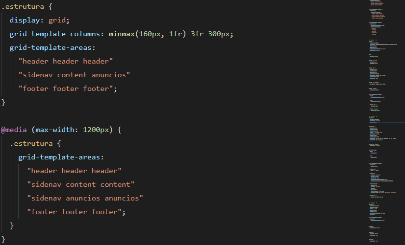

# Readme

 <h2 align="center">Wildbeast</h2>

Projeto criado com objetivo de aplicar e praticar todos os conceitos de CSS Grid.

## Tabela de conteudo

- [Gifs](#gifs)
- [Tecnologia utilizada](#tecnologias)
- [Como utilizar](#utilização)
- [Veja o projeto funcionando.](#funcionando)

   

   <h4 align="center">&#11088 Projeto Wildbeast &#11088 </h4>
    

### Características

- [x] Responsivo
- [x] Grid Layout

  
 

  

## Gifs

<h3>Responsivo</h3>  
      
    <h3>Grid Layout</h3> 
      
     
      
 

 
 

 
 ## Tecnologias 
 
 <h2>utilizada</h2> 

- HTML 
- CSS 

 

 

## Utilização

Projeto usando apenas tecnologias de fácil utilização não necessita nenhuma instalação.

 

 

   
 

  

## Funcionando

  
Click no botão abaixo e visualize o projeto 

 
  <button  style="padding:8px 20px; border-radius:5px; border:none; background:black;"><a style="color:aqua;" target="_blank" href="https://fernandoroch.github.io/Wildbeast/">Ir para projeto</a>
  </button>
  

   
 

  

### Criado por fernando rocha.

Rede Sociais:

- <a target="_blank"  href="https://www.linkedin.com/feed/?trk=404_page">linkedin</a>
- <a target="_blank"  href="https://www.instagram.com/_daycode_/">Instagram</a>
- <a target="_blank"  href="https://www.tiktok.com/@_daycode_">TikTok</a>
